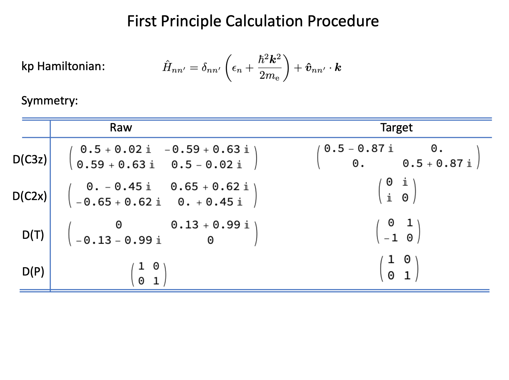

## Requirements:

1. Read the Chapter 2 of [[Winkler-2003-Spin-orbit coupling effects in two-dimensional electrons and hole systems]](http://library.lol/main/D0BB9499949411E6B55D961FB11D71C1), [[arXiv:1512.05084]](https://arxiv.org/abs/1512.05084) and [[PRB **82**, 045122 (2010)]](http://dx.doi.org/10.1103/PhysRevB.82.045122) to acquire the theoretical background about the kp Hamiltonian and *g*-factors. 
2. Know the basic procedures of [VASP](https://www.vasp.at).
3. Theory of invariants.(Group theory)

## Procedures:

1. Perform a static self consistent calculation to get files **“CHG”** and **“CHGCAR”**.
2. Take the band calculation at a single $k$ point to get the files **“WAVECAR”** and **“EIGENVAL”**(saved as “EIGENVAL.Pi”)
3. Calculate the momentum matrix elements with [vasp.5.3.song.2018]
4. Extract the kp Hamiltonian and the g-factor with matlab [demo.m].

## Demo—Bi2Te3:

[Get the demo file here.](https://www.icloud.com.cn/iclouddrive/059uZC3fHCWik7nEPg2Wc-4Ig#demo)

### How to run this demo:

1. On your sever: `qsub demo.pbs`  
Before doing this, you have to change the variable “vasp_song” in file “demo.pbs” to your path of [vasp.5.3.song.2018]. The procedures 1, 2 and 3 has been included in this pbs file.
2. On your local computer with matlab:  
`scp "Delta:~/demo/{POSCAR,EIGENVAL.Pi,MAT*.m}" ./demo/data`
3. run `demo.m` in matlab.

### How to understand this demo:

1. The kp Hamiltonian and gfactor of Bi2Se3 family with up to third order of $k$ is summarized in [[arXiv:2203.14301]](https://arxiv.org/abs/2203.14301) section “Sb2Te3 thin film” which explains that what these parameters represent.

## Key points:

1. Due to the degeneracy, the symmetry representation has to be fixed by hand in `demo.m`. In Bi2Se3 family we fix the representation as 
    
    
    
    The raw representation is saved in variable “C3z”, “C2x”, “T” and “P”. The transformed representation is saved in “C3z_trans”, “C2x_trans”, “T_trans” and “P_trans”. Procedures to fix the representation is explained in the Appendix PPT. Under this representation the table of theory of invariants is 
    
    
    
    From which we can construct the analytical expression of kp Hamiltonian and g-factors as given in [[arXiv:2203.14301]](https://arxiv.org/abs/2203.14301) section “Sb2Te3 thin film”.
    
2. Band Indices, on which construct the kp Hamiltonian, has to be declared at “band_start” and “band_end” in `demo.m`, also at “bstart” and “bend” in `INCAR.song.#` 

## Appendix:

